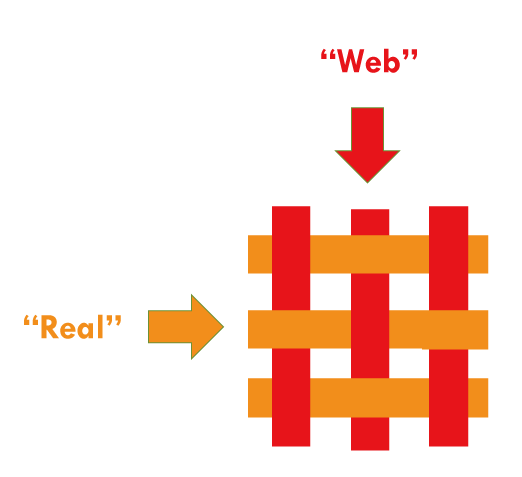

# CHIRIMEN Open Hardware コミュニティの活動ついて

https://chirimen.org/

IoT や WoT といったコンセプトが示す、さまざまなモノが
コンピュータネットワークで繋がる未来の社会においても、
私たちヒトは重要な存在です。

ヒトとモノがウェブを介して互いに協調しあえる環境が必要です。
そして、それはウェブブラウザを核に作られていくのはないかと考えます。

本プロジェクトは、このような環境（プラットホーム）を参加者の
皆さんとオープンにデザインし、つくりあげていくことをめざします。

# CHIRIMEN とは

CHIRIMEN はセンサーやアクチュエーターなどの物理デバイスを Web ブラウザ技術だけで制御することができる
開発環境で、ボードコンピュータとその上で動作するソフトウェアを含めた総称です。

CHIRIMEN = 縮緬（織物）

“Web” と “Real” 異なる世界を織り込んで新しいモノを作っていく

