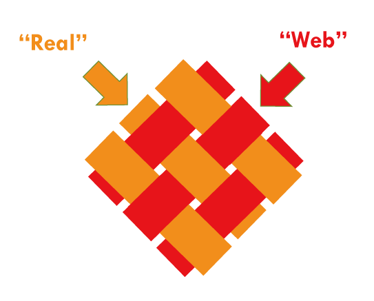

### CHIRIMEN とは
CHIRIMENコミュニティではCHIRIMENと呼ぶ開発環境を開発しています。これはセンサーやアクチュエーターなどの物理デバイスを Webブラウザ技術だけ、すなわちHTML+CSS+JavascrptによるWebアプリケーションで制御することができるものです。

### CHIRIMEN の語源 = 縮緬（織物）

  

#### “Web” と “Real” を織り込んで、新しいモノを作っていく

センサーやアクチュエータを使ったIoTシステムを作ろうとすると、特別な知識 それも特定のデバイスやクラウドの製品に特化した知識がいくつも必要でした。それに対してCHIRIMENは、一般的なWebアプリケーション構築の知識だけで、もっと簡単にIoTシステムを作ることができます。これによってIoTシステムのプロトタイピングや学習を効率よく進めることができます。
