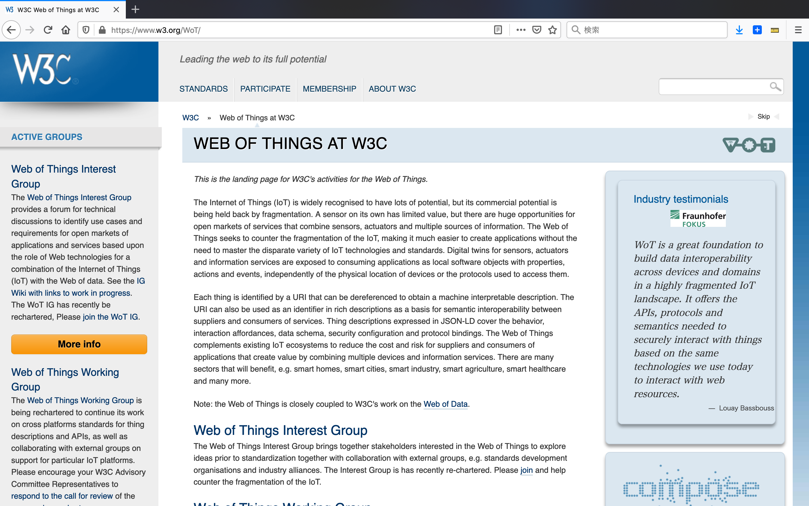

## What is WoT and IoT？

w3.orgより引用 https://www.w3.org/WoT/

## What is WoT and IoT？
Web of Things（WoT）は、実世界のオブジェクトを
World Wide Webの一部にするためのアプローチ、
ソフトウェアアーキテクチャスタイル、プログラミングパターンを
記述するための用語です。

wikipedia.orgより引用
https://en.wikipedia.org/wiki/Web_of_Things

