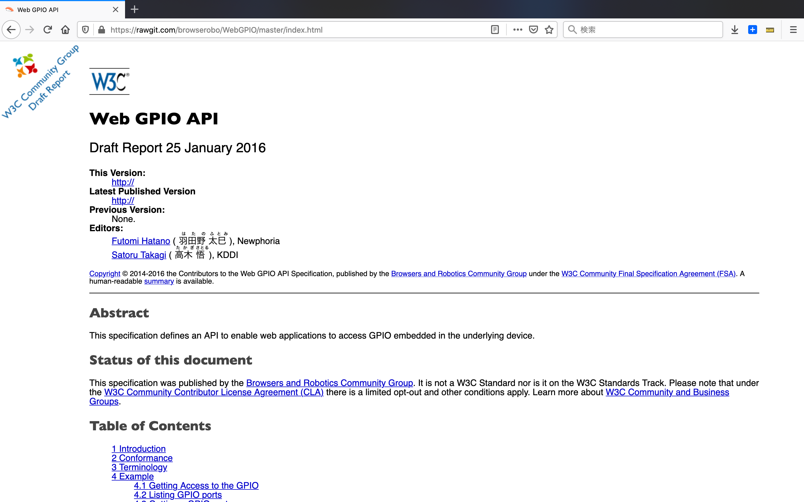
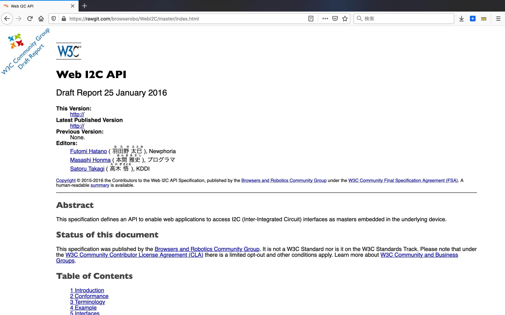
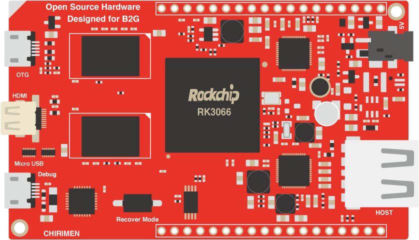

# CHIRIMEN の活動

## オープンソースソフトウェア
- Webブラウザの技術だけで、ハードウェア制御の開発を出来るようにする事
- この目的のため以下の活動を行っています
  - W3C へ提案 
    - [WebGPIO](https://rawgit.com/browserobo/WebGPIO/master/index.html)
    - WebI2C 
  - ポリフィル開発実装なども含みます。

### プロタイプ環境
### Web GPIO のドラフト提案

https://rawgit.com/browserobo/WebGPIO/master/index.html

### Web I2C のドラフト提案

https://rawgit.com/browserobo/WebI2C/master/index.html

## オープンソースハードウェア
OSSの開発方法・考え方を、ハードウェア(ボードコンピュータも対象)に広めること。

### Echigo Rev.1

これまでの実績
  
ケース
シールド
テストボード

ボード本体・ケースなど
Open Source Hardware JP000003 OSHWA,
 http://cerQficate.oshwa.org/cerQficaQon-directory/

  When think about a new designed single board computer #193
　https://github.com/chirimen-oh/any-issues/issues/193

先の２つのゴールを多くの人達に（教育，
デモストレーションなどを通して）社会に広める事 
