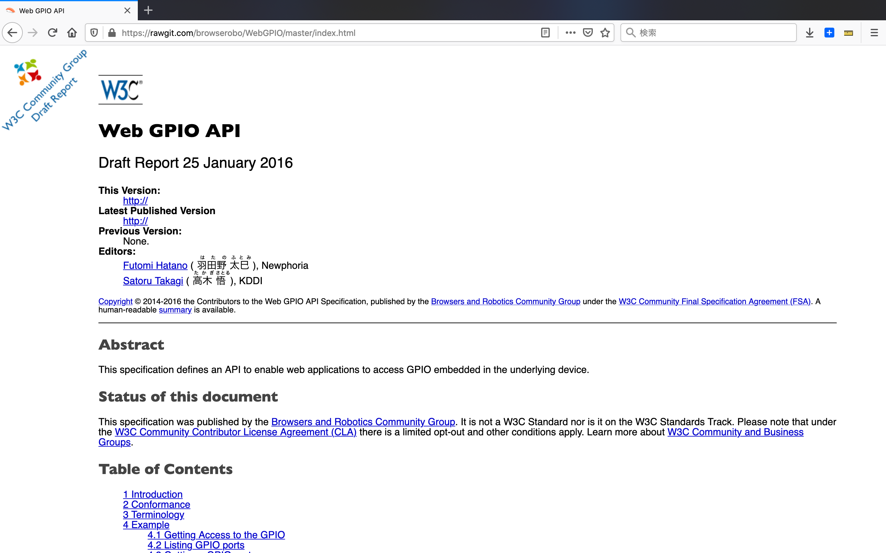
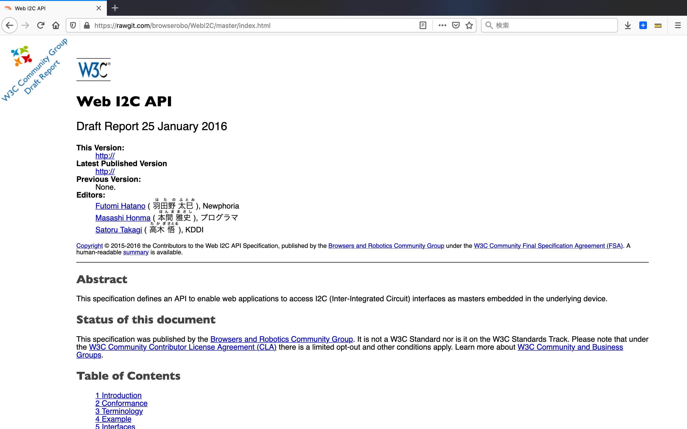

# CHIRIMEN の活動

## オープンソースソフトウェア
Webブラウザの技術だけで、ハードウェア制御の開発を出来るようにする事
この目的のためにW3C に WebGPIO, WebI2C へ提案 やポリフィル開発実装なども含みます。

### プロタイプ環境
### Web GPIO のドラフト提案

https://rawgit.com/browserobo/WebGPIO/master/index.html

### Web I2C のドラフト提案

https://rawgit.com/browserobo/WebI2C/master/index.html

## オープンソースハードウェア
開発ボード
  Echigo Rev.1
ケース
シールド
テストボード

OSSの開発方法・考え方を、ハードウェア
(ボードコンピュータも対象)に広めること。

ボード本体・ケースなど
Open Source Hardware JP000003 OSHWA,
 http://cerQficate.oshwa.org/cerQficaQon-directory/

  When think about a new designed single board computer #193
　https://github.com/chirimen-oh/any-issues/issues/193

先の２つのゴールを多くの人達に（教育，
デモストレーションなどを通して）社会に広める事 
