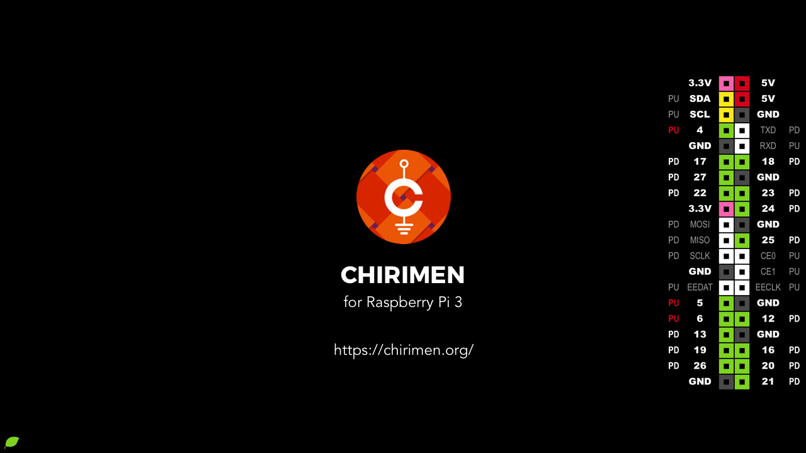
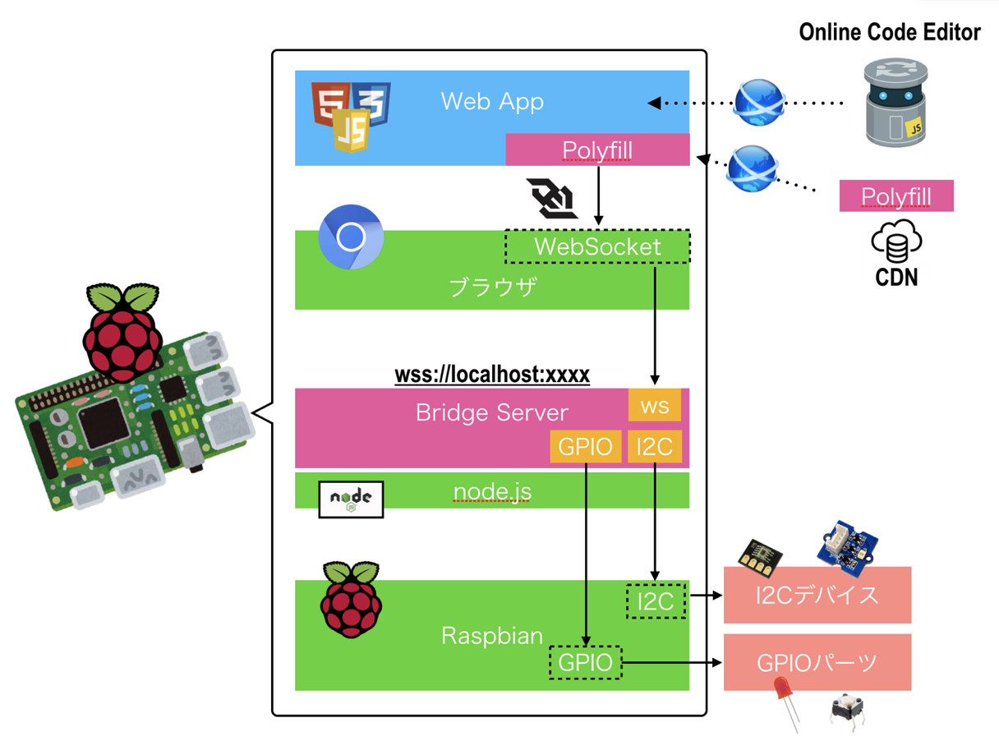

### CHIRIMEN for Raspberry Pi
- Raspberry Pi の 標準 OS Raspbian をカスタマイズした CHIRIMEN 環境を提供しています
  - https://github.com/chirimen-oh/chirimen
 
  

- Raspberry Pi の OS におけるプロトタイピング環境の構成図
  

- デバイスをコントロールする WebAPI として WebGPIO と、WebI2C が実装されています。
