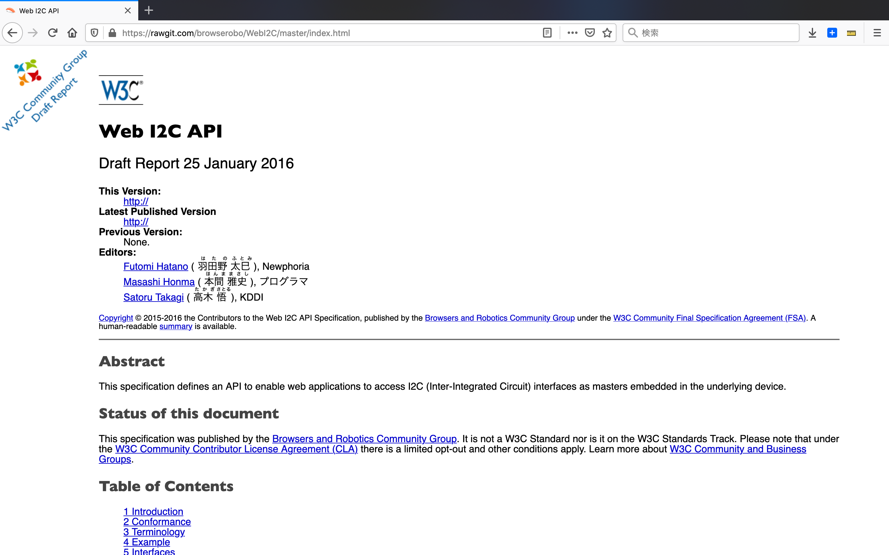

# オープンソースソフトウェア
## プロトタイピング環境の構築
-  ラズベリーパイのOSをカスタマイズし、プロトタイピング環境を構築しています
  - https://github.com/chirimen-oh/chirimen
 
  

## W3C へ提案 
### [Web GPIO](https://rawgit.com/browserobo/WebGPIO/master/index.html) のドラフト
  

## [Web I2C](https://rawgit.com/browserobo/WebI2C/master/index.html) のドラフト
  

