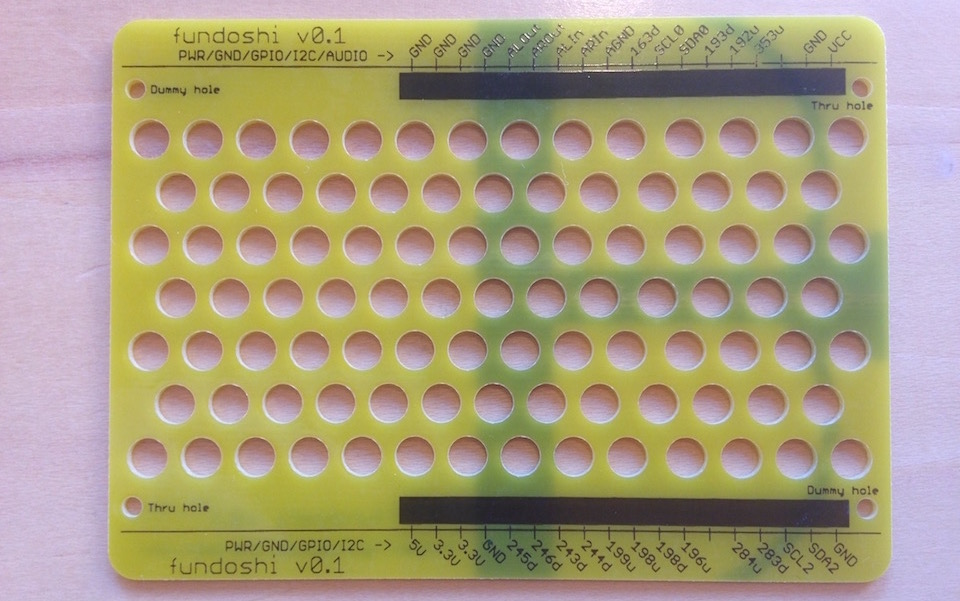

## オープンソースハードウェア
- OSSの開発方法・考え方を、ハードウェア(ボードコンピュータも対象)に広めること。
- コミュニティが公開したハードウェア作品は以下の通りです。

### Echigo Rev.1
- [Echigo Rev.1 Hardware](https://github.com/chirimen-oh/release/tree/master/hardware)
- [Open Source Hardware JP000003](https://certification.oshwa.org/jp000003.html)
  

### rpi3GpioTester
- [CHIRIMEN rpi3GpioTester](https://github.com/chirimen-oh/accessories/tree/master/forRaspberryPi3/rpi3GpioTester)
- [Open Source Hardware JP000006](https://certification.oshwa.org/jp000006.html)
  

### Temp Sensor for CHRMN is a ADT7410 temperature
- [Temp Sensor for CHRMN is a ADT7410 temperature](https://github.com/chirimen-oh/accessories/tree/master/grove/adt7410)
- [Open Source Hardware JP000007](https://certification.oshwa.org/jp000007.html)
  

### Echigo Rev.1 ケース 
- [fundoshi](https://github.com/chirimen-oh/Cases/tree/master/fundoshi)
  

- [kimono](https://github.com/chirimen-oh/Cases/tree/master/kimono)
  

