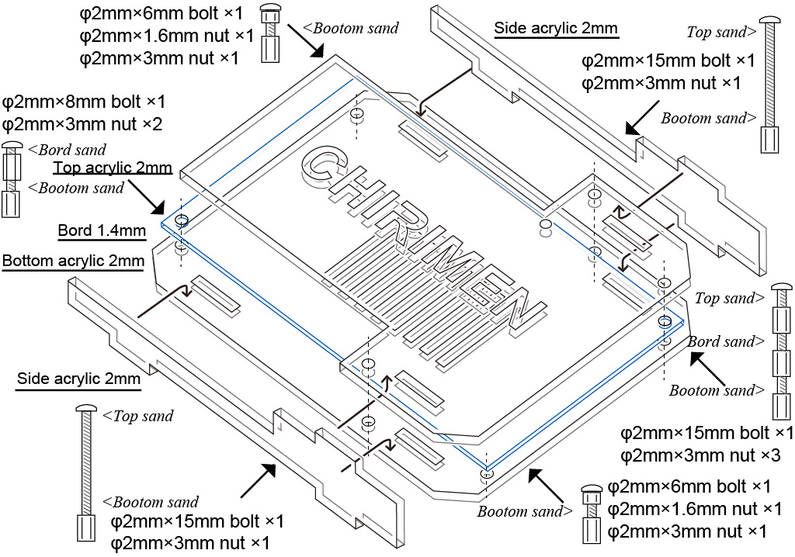

## オープンソースハードウェア
OSSの開発方法・考え方を、ハードウェア(ボードコンピュータも対象)に広めること。

### Echigo Rev.1
- [Open Source Hardware JP000003](https://certification.oshwa.org/jp000003.html)
  

### rpi3GpioTester
- [CHIRIMEN rpi3GpioTester](https://certification.oshwa.org/jp000006.html)
  

### Temp Sensor for CHRMN is a ADT7410 temperature
- [Temp Sensor for CHRMN is a ADT7410 temperature](https://certification.oshwa.org/jp000007.html)
  

### Echigo Rev.1 ケース 
- [fundoshi](https://github.com/chirimen-oh/Cases/tree/master/fundoshi)
  

- [kimono](https://github.com/chirimen-oh/Cases/tree/master/kimono)
  

