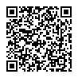
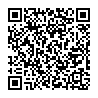
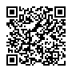
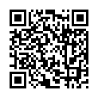

### 各種リンク QR コード

#### CHIRIMEN for Raspberry Pi

#### CHIRIMEN with TY51822r3

#### CHIRIMEN with micro:bit

#### CHIRIMEN ボード　(Echigo Rev.1) 

#### WebGPIO , WebI2C on node.js

#### CHIRIMEN accessories

#### オンライン版 i2c-ADT7410

### Example 集ページ

