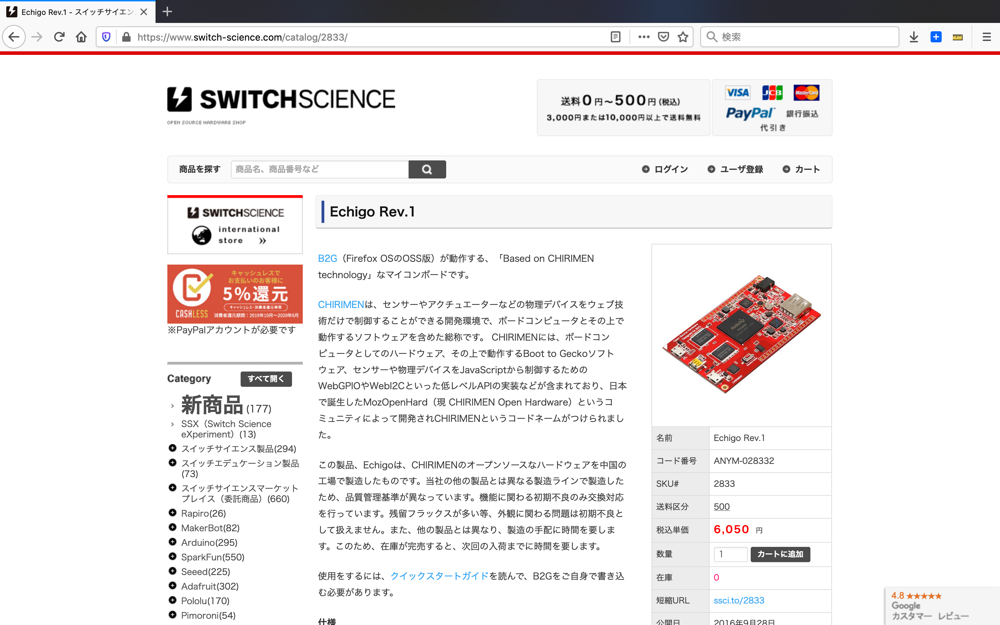

# TBD
### 2016年02月
- KDDI が Mozilla factory の思想に賛同し同活動に・スポンサー＆メンバーなったのを期にMozOpenHardプロジェクトがスタート

### 2016年04月
- "CHIRIMEN's day" オープンソース化達成

### 2016年08月
- Switch Science より CHIRIMEN ボード 販売開始
- CHRIMEN ボード first firmware image 公開

### 2016年09月
- The Sale Memorial Day Event CHIRIMEN ボード hands-on"

### 2016年12月
  date: "December 31 2016"
- CHIRIMEN ボード had certified by the OSHA."

### 2017年01月
- CHIRIMEN ボード Echigo Rev.1 was sold-out!"

### 2017年02月
- CHIRIMEN touch & try events."

### 2017年03月
- New firmware had released."

### 2017年11月
- CHIRIMEN for Raspberry Pi 3 released."

### 2018年10月
- CHIRIMEN for Raspberry Pi 3 Ver.2018/10/10 released."

# TODO
- 表形式にする？
- B2G OSの件も書きたい

