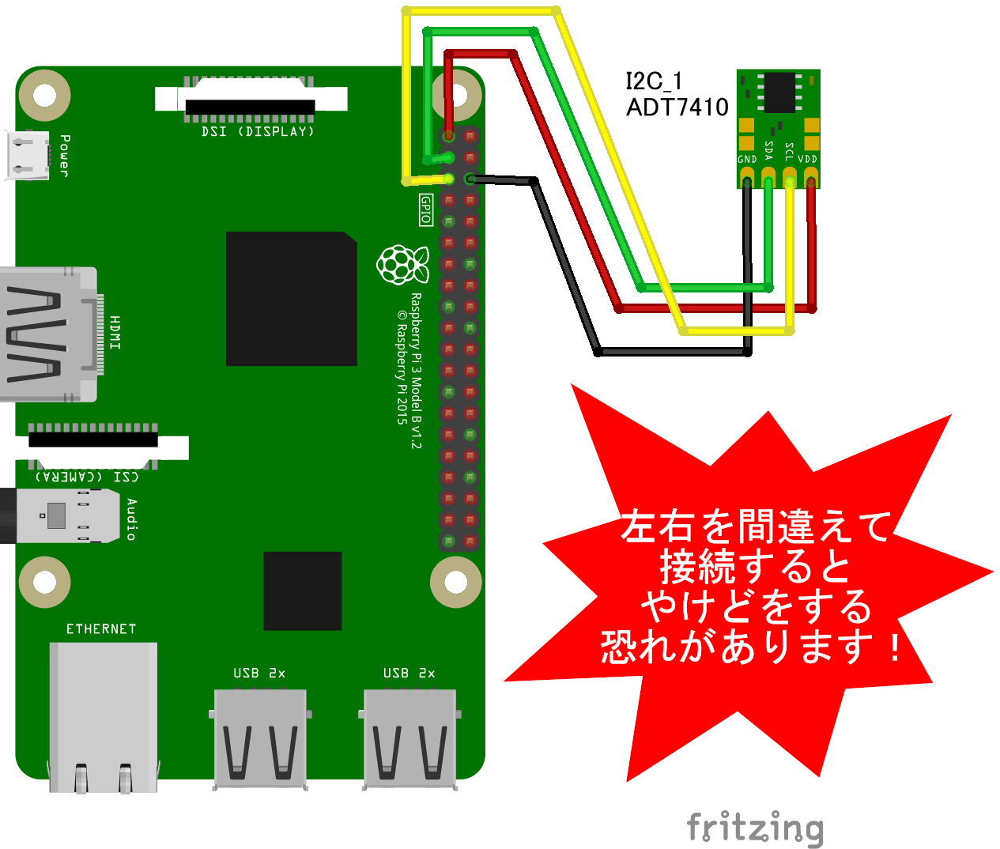

## ボードと機材を配線しよう

　
左図と同じように配線してみよう。
配線を間違えるとセンサーが高熱になり火傷・破損するので注意してください。

配線できたらターミナルを開いて下記コマンドを入力してみてください。

```sh
$ i2cdetect -y -r 1
```


[右図](imgs/section2/ADT7410.png) のような画面が表示されるはずです。`i2cdetect` コマンドでは I2C バスに接続されている Slave アドレス (デバイス毎の割り当て番号) を確認できます。i2cdetect WebI2C 版(http://r.chirimen.org/i2cdetect) でも確認できます。アドレスが表示されない場合は配線などの間違いがないか確認してください。

