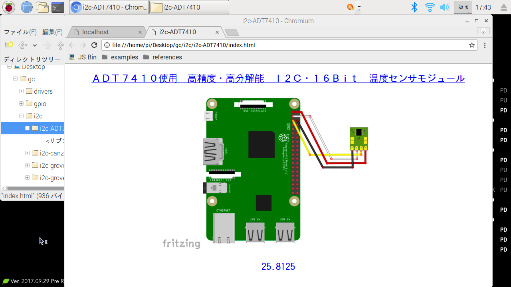

## Example コードを実行しよう

`/home/pi/Desktop/gc/i2c/i2c-ADT7410/index.html` ファイルを開いて実際に動かしてみよう。ブラウザが起動し下図 のような画面になります。

画面下部に数字がでていますね。これが温度センサーから取得した現在の温度 (摂氏) の表示になります。

**補足**: オンライン版(https://r.chirimen.org/i2c-adt7410) でも同じコードで試せます。