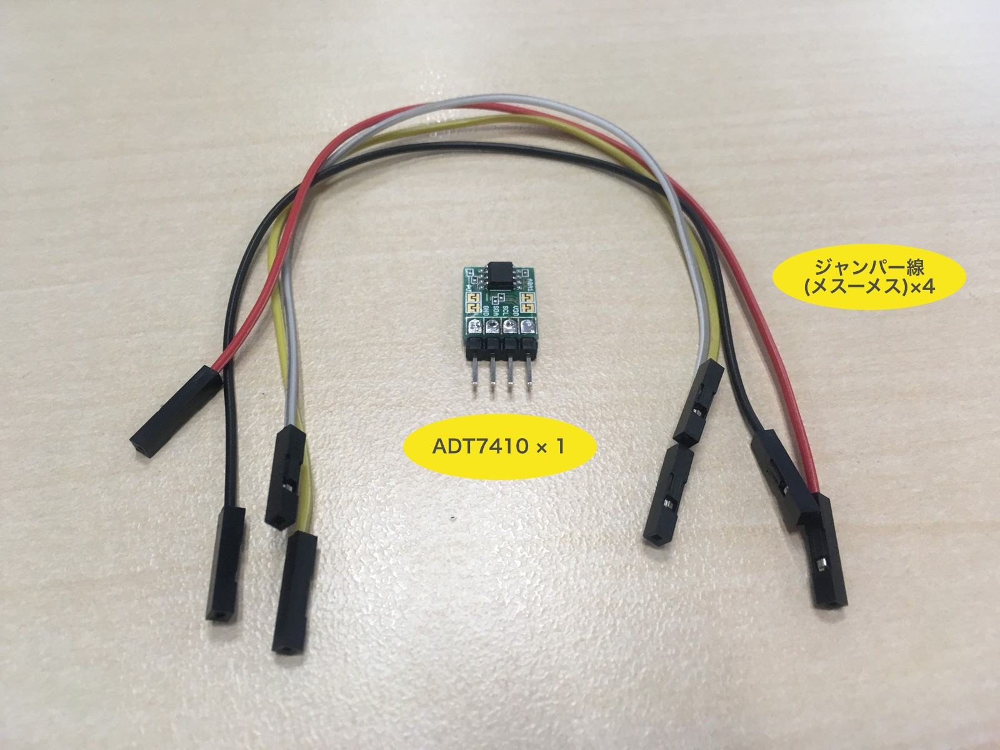

# Hello Real World

CHIRIMEN for Raspberry Pi (Raspi) を使って L チカ (LED を点滅) したりセンサー (温度計) を使ってみよう。

# 機材の準備
| CHIRIMEN for Raspi 基本セット                                                                                                                                                                              | L チカセット                                                                                                                                                                                 | 温度センサーセット                                                                                                                                                                                         |
| ---------------------------------------------------------------------------------------------------------------------------------------------------------------------------------------------------------- | -------------------------------------------------------------------------------------------------------------------------------------------------------------------------------------------- | ---------------------------------------------------------------------------------------------------------------------------------------------------------------------------------------------------------- |
|  |  |  |

- CHIRIMEN for Raspi 基本セット
  - Raspberry Pi ([3 Model B](https://www.raspberrypi.org/products/raspberry-pi-3-model-b/), [3 Model B+](https://www.raspberrypi.org/products/raspberry-pi-3-model-b-plus/) もしくは [4 Model B](https://www.raspberrypi.org/products/raspberry-pi-4-model-b/)) × 1
  - 5V3A 対応 AC アダプタ + micro B USB 電源ケーブル (例: [Raspberry Pi 用電源セット](https://www.physical-computing.jp/product/1171)) × 1 セット
  - HDMI 入力つきのモニタ + HDMI ケーブル (モニタ側の端子の種類に注意) × 1 セット
  - USB マウス、キーボード (日本語配列) × 1 セット
  - [CHIRIMEN 起動イメージ](sdcard.md)入りの micro SD カード (8GB 以上必須、Class 10 以上で高速なものを推奨) × 1
- L チカセット
  - ブレッドボード (通常サイズまたはミニサイズ) × 1
  - リード付き LED × 1
  - リード付き抵抗器 (150-470Ω) x 1
  - ジャンパーワイヤー (オス-メス) x 2
- 温度センサーセット
  - [ADT7410 使用 I2C 温度センサーモジュール](http://akizukidenshi.com/catalog/g/gM-06675/) (ピンヘッダ半田付け済み)
  - ジャンパーワイヤー (メス-メス) x 4

-----
