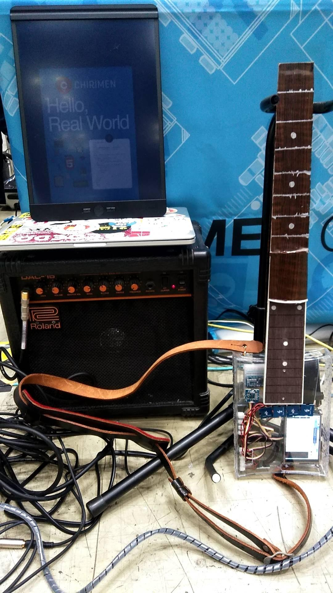
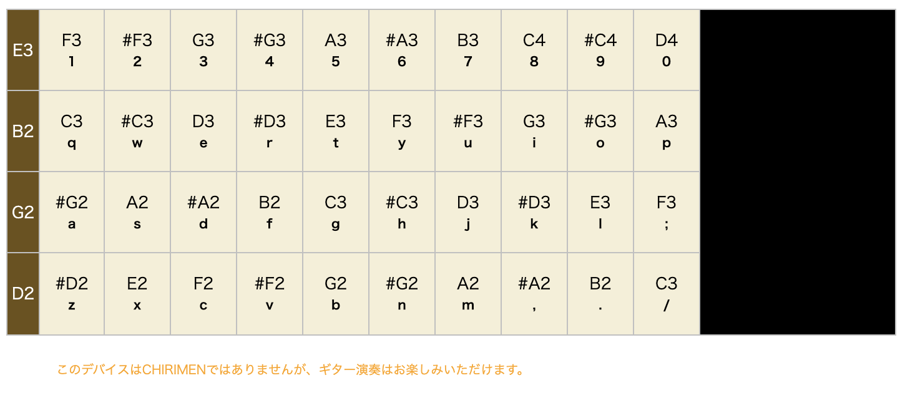

## 利用したもの

### ぴあのから流用したもの

- Raspberry Pi 3 model B+[^*3]
- TOSHIBA microSDHC 16GB
- Grove - I2Cタッチセンサー
- Grove - I2C Hub
- Grove - ジェスチャー
- Grove 4ピンコネクタ - ジャンパーピン変換ケーブル
- Raspberry Pi に接続できるスピーカー
- Raspberry Pi 電源アダプター

以下は私の作品では利用しましたが、なくても動作します。

- USBマウス/キーボード
- Adafruit PiTFT Plus 480x320 3.5インチTFT
- Adafruit GPIOリボンケーブル - 26ピン

### ぎたー用に新しく利用したもの

- ADS1015搭載 12BitADC 4CH 可変ゲインアンプ付き
- JST to Breadboard Jumper (3-pin) x4本
- SoftPot接触位置センサ200mm x4本
- ギターフレットボード
- ブレッドボード/足長ソケット/ジャンパー(AWG22)
- 木目調シート(100均にあるもの)
- クリアケース(100均にあるもの)
- シルバーラッカー(100均にあるもの)
- チップスターの缶(食べ終わったもの)

完成画像は以下のとおりです（MakerFaireでの展示風景です）。

画面イメージは以下のとおりです。

