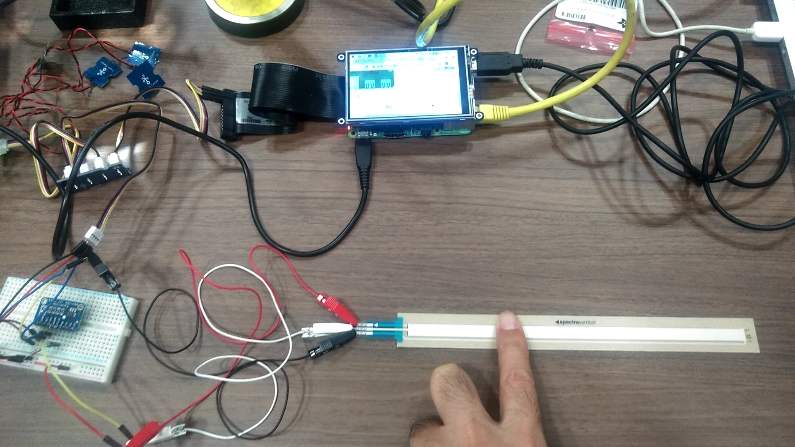
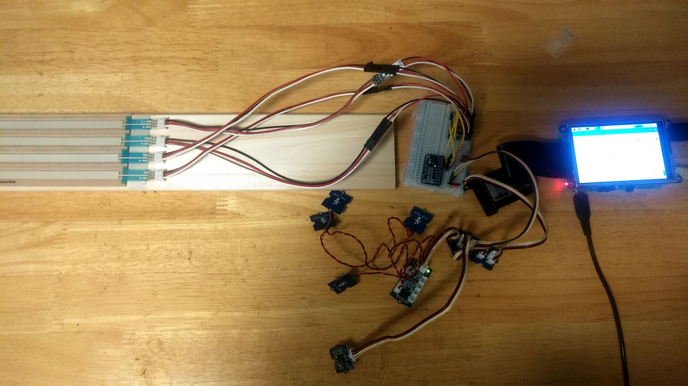
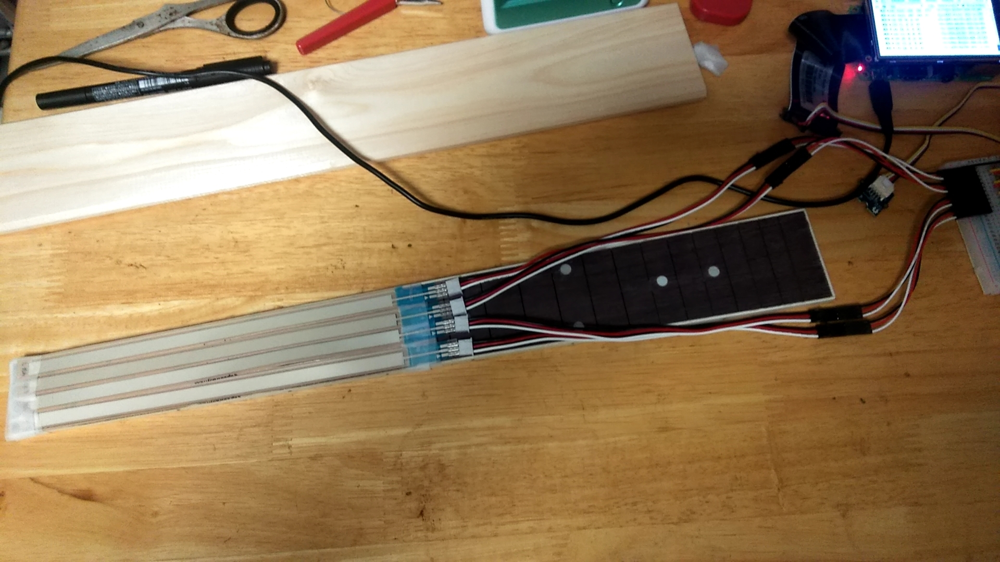
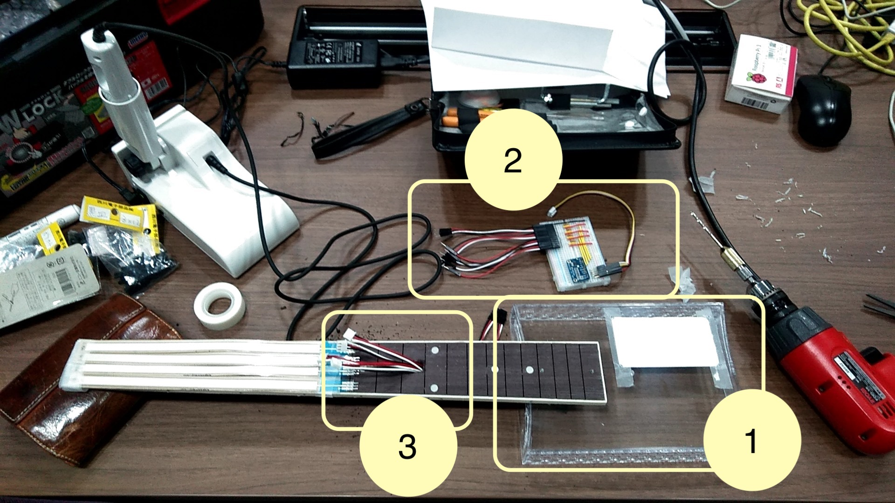
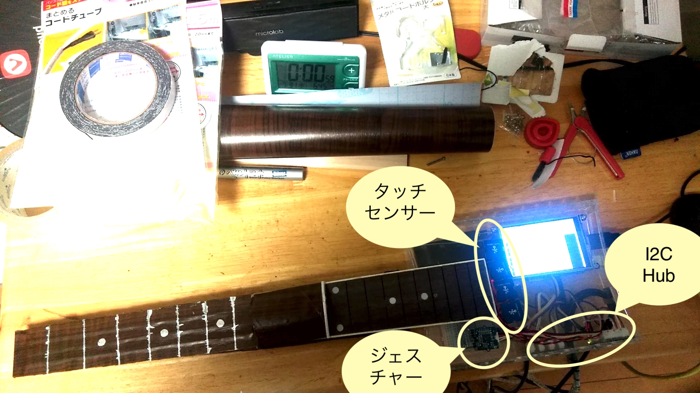
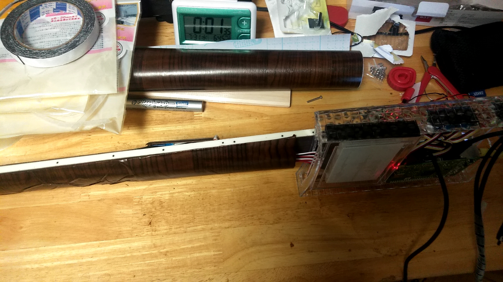

# ぎたーの製作

本節で紹介するのは Maker Faire Tokyo 2019[^*1] へ出展したときのデモ作品です。

## CHIRIMENぎたーとは

chirimen-guiter [^*2] という「ギターっぽい」アプリを作りました。

このアプリの特徴は以下のとおりです。

- 前節で作成したCHIRIMENぴあのをベースに作られていて、以下の新しいCustomElementsの実装評価を兼ねています
    - chirimen-ads1015 タグ
- CHIRIMENでなくても動作するWebアプリである

CHIRIMENの特徴(ブラウザで実行される)を活かして、PC/スマホ/Raspberry Piのどこからでも遊ぶことができるようになっています。

## 利用したもの

### ぴあのから流用したもの

- Raspberry Pi 3 model B+[^*3]
- TOSHIBA microSDHC 16GB
- Grove - I2Cタッチセンサー
- Grove - I2C Hub
- Grove - ジェスチャー
- Grove 4ピンコネクタ - ジャンパーピン変換ケーブル
- Raspberry Pi に接続できるスピーカー
- Raspberry Pi 電源アダプター

以下は私の作品では利用しましたが、なくても動作します。

- USBマウス/キーボード
- Adafruit PiTFT Plus 480x320 3.5インチTFT
- Adafruit GPIOリボンケーブル - 26ピン

### ぎたー用に新しく利用したもの

- ADS1015搭載 12BitADC 4CH 可変ゲインアンプ付き
- JST to Breadboard Jumper (3-pin) x4本
- SoftPot接触位置センサ200mm x4本
- ギターフレットボード
- ブレッドボード/足長ソケット/ジャンパー(AWG22)
- 木目調シート(100均にあるもの)
- クリアケース(100均にあるもの)
- シルバーラッカー(100均にあるもの)
- チップスターの缶(食べ終わったもの)

完成画像は以下のとおりです（MakerFaireでの展示風景です）。

画面イメージは以下のとおりです。

## 操作方法

### PCやスマホでのプレイ方法：

PCの場合は、フレットがキーボードにアサインされています。
F3, E2などの音階の下にアサインされているキーを表示しています。
たとえばC3の場合は `q` キーを、F2の場合は `c` キーを押します（同時に複数のキーを押してコードにすることも可能です）。
音を鳴らすには、右側の黒い部分をマウスホバーして上下すると音が鳴ります。

スマホの場合は、タッチ(マルチタッチ)に対応しています。
回転固定アプリなどを使って、横向き、上下反転すると、通常のギターを操作するのと同じようにフレットをおさえることができます。
ピックアップが右の黒い部分なのはPC版と同じですが、スマホ版ではここを擦る（スワイプする）ことで音が鳴ります。

### CHIRIMENでのプレイ方法：

普通のギターっぽく演奏できます！

## 工夫したこと

### フレット

ギターのフレットには、どこが押されたかを調べるため、 `SoftPot接触位置センサ` を利用することにしました。
このセンサーは曲げセンサーなどと同じで、押した箇所の抵抗が上がることでアナログ値として、起点からの距離を知ることができます。
このセンサーを弦の代わりに6本はれば良いわけですが、センサーの幅が両端をギリギリまでカットしても1cmあります。
ギターのフレットボードは一番幅が狭い箇所が4cmぐらいなので、6本はどうみても無理。
ということで、スクリーンショットなどでもわかるとおり、4弦ギターになっています（それはベースなのでは？とかウクレレで良かったのでは？という話はありますが、私がデモプレイできないので... ry）

まずはCHIRIMENとADS1015を使って、SoftPot接触位置センサから値が取得できるかを調べます。
ADS1015のオンラインサンプル[^*4]があるので、
センサーを接続してCHIRIMENのブラウザで動作確認します。
ちょっとわかりずらいですが、Raspi上のTFTモニタにサンプル画面が表示され、押した場所の値が表示されています。

次に4本接続して値が取得できるかを確認します。
この段階では `<chirimen-ads1015>` タグの仮実装までして、WebI2Cタグで値が取得できるかを確認しています。

SoftPot接触位置センサからは、 `JST to Breadboard Jumper` を使って、
ジャンパー経由でブレッドボードに落としています。JSTコネクタは2.5mm幅でハンダ付けの必要がなく接触位置センサーと接続できそうだったので、導入しました。
接触位置センサーのはんだ端子が結構微妙なので、この方式が良いと思います（実際には公式カタログにはコネクタ端子の製品もあるのですが、店舗やオンラインショップなどでは見つかりませんでした）。

あとはセンサー左右の耳の部分をカッターで切り落とし、ギターフレットに貼り付けてみます。
なんとか4本を敷きつめられました。
耳のカットは、まず1本やって、値がちゃんと取れることを確認してから4本実施。
もしカットして値が取れなくなっていたら、戦略の見直しが必要なところでしたが、良かったです。
（実はスリムタイプという製品が販売元のページにあるのを知っていて、カットしたら同じなんじゃない？という感覚があったのも良かったと思います）

最後の仕上げです。

1. クリアケースとフレットボードを取り付け
1. ブレッドボードでAD変換してGrove端子にするような回路を作成
1. フレットボードの裏側に接触位置センサーのケーブルを取り回すように穴あけ

### その他

クリアケースにCHIRIMENとI2Cハブを取り付けます。
そこからchirimen-pianoでも利用したタッチセンサーとジェスチャーセンサーをクリアケースの外側に取り付けます。

この2つのセンサーはプレイ方法に関係します。
フレットに利用した接触位置センサーの値は、PC/スマホ版のキーボードやタッチと同じで、音階を指定するだけです。
タッチとジェスチャーは、PC/スマホ版の黒い部分と連動していて、ジェスチャーは何か動きがあったときにストロークプレイ、
タッチは4弦と連動してアルペジオプレイができるように、アプリケーションを実装しています。

見た目とプレイしやすさから `チップスターの缶` をいい感じにカットしてフレット裏の湾曲を作りました。
これでFコードなどを抑えるのも用意になります。

接触位置センサーは木目調シートで隠して、ちゃんとしたフレット位置にシルバーラッカーで目印を書いておきます。

### 音源

ピアノはWebAudioを素で使っても何とかできるのですが、ギターはさすがに難しいので webaudiofont[^*5]を利用しました。
webaudiofontには、ピアノ/パーカッション/オルガン/ギター/ベース/各種弦楽器/吹奏楽器など様々な音源が提供されています。

## CHIRIMENでやってよかったこと

- WebAudioで簡単に音が鳴らせて、楽器が作りやすい
- PC/スマホ/Raspberry Piで遊べる
- アプリ自体はPCで作っていき、デバイスとの連携だけ追加できるので開発が楽
- GitHubにソースコードを置いて、GitHub Pagesで公開して遊べる

ぴあのはシンプルだったのですが、ギターのアプリの複雑さを考えると、
PCで開発して動くようになってから物理デバイスとの連動を考えられるのは、
Webアプリケーション開発者から見るととても親和性があり、実装しやすいです
（実際にギターのWebアプリを作るのにもかなりの時間がかかりました）。

[^*1]: http://makezine.jp/event/mft2019/
[^*2]: ソースコード https://github.com/sizuhiko/chirimen-guiter
[^*3]: 当時の最新機種
[^*4]: http://chirimen.org/chirimen-raspi3/gc/i2c/i2c-ADS1015/
[^*5]: https://surikov.github.io/webaudiofont/