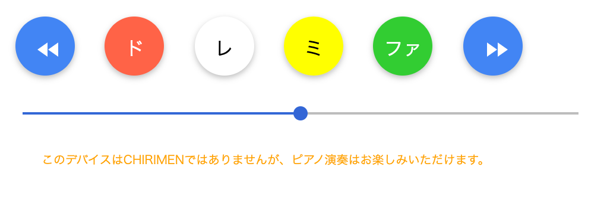

### ぴあの製作

本節で紹介するのは Maker Faire Tokyo 2018[^*1] へ出展したときのデモ作品です。

#### CHIRIMEN ぴあの とは

chirimen-piano [^*2] という「ピアノっぽい」アプリを作りました。

このアプリの特徴は以下のとおりです。

- Polymer3[^*3]で作られていて、以下のCustomElementsの実装評価を兼ねています
    - web-i2c タグ
    - grove-gesture タグ
    - grove-touch タグ
- CHIRIMENでなくても動作するWebアプリである
- 4鍵(タッチセンサーの4つが対応)しかないが、左右に手を振ることでジェスチャーセンサーが反応し、音階が移動する。CHIRIMENでない場合は左右ボタンで移動

CHIRIMENの特徴(ブラウザで実行される)を活かして、PC/スマホ/Raspberry Piのどこからでも遊ぶことができるようになっています。

#### 利用したもの

- Raspberry Pi 3 model B+[^*4]
- TOSHIBA microSDHC 16GB
- Grove - I2Cタッチセンサー
- Grove - I2C Hub
- Grove - ジェスチャー
- Grove 4ピンコネクタ - ジャンパーピン変換ケーブル
- Raspberry Pi に接続できるスピーカー
- Raspberry Pi 電源アダプター

以下は私の作品では利用しましたが、なくても動作します。

- USBマウス/キーボード
- Adafruit PiTFT Plus 480×320 3.5インチTFT
- Adafruit GPIOリボンケーブル - 26ピン

完成画像は以下のとおりです（MakerFaireでの展示風景です）。

画面イメージは以下のとおりです。

