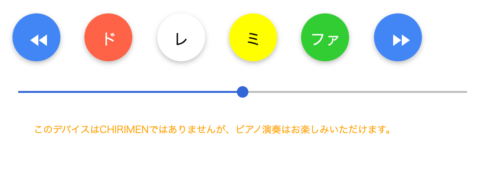

# ぴあの製作

本節で紹介するのは Maker Faire Tokyo 2018[^*1] へ出展したときのデモ作品です。

## CHIRIMENぴあの とは

chirimen-piano [^*2] という「ピアノっぽい」アプリを作りました。

このアプリの特徴は以下のとおりです。

- Polymer3[^*3]で作られていて、以下のCustomElementsの実装評価を兼ねています
    - web-i2c タグ
    - grove-gesture タグ
    - grove-touch タグ
- CHIRIMENでなくても動作するWebアプリである
- 4鍵(タッチセンサーの4つが対応)しかないが、左右に手を振ることでジェスチャーセンサーが反応し、音階が移動する。CHIRIMENでない場合は左右ボタンで移動

CHIRIMENの特徴(ブラウザで実行される)を活かして、PC/スマホ/Raspberry Piのどこからでも遊ぶことができるようになっています。

## 利用したもの

- Raspberry Pi 3 model B+[^*4]
- TOSHIBA microSDHC 16GB
- Grove - I2Cタッチセンサー
- Grove - I2C Hub
- Grove - ジェスチャー
- Grove 4ピンコネクタ - ジャンパーピン変換ケーブル
- Raspberry Pi に接続できるスピーカー
- Raspberry Pi 電源アダプター

以下は私の作品では利用しましたが、なくても動作します。

- USBマウス/キーボード
- Adafruit PiTFT Plus 480x320 3.5インチTFT
- Adafruit GPIOリボンケーブル - 26ピン

完成画像は以下のとおりです（MakerFaireでの展示風景です）。


画面イメージは以下のとおりです。



## 操作方法

### PCまたはスマホの場合

- 音を鳴らす: 音階のボタンをクリック/タップ、スマホの場合は同時タップで和音
- 音階の移動: ◀︎◀︎ または ▶︎▶︎ のボタンをクリック/タップ
- 音量の変更: スライダーを左右に移動

### CHIRIMENの場合

- 音を鳴らす: タッチセンサーをタッチ、複数タッチで和音
- 音階の移動: ジェスチャーセンサーの上で左右に手を振る
- 音量の変更: ジェスチャーセンサーの上で上下に手を振る(下向き:音量下/上向き:音量上)

## CHIRIMENでやってよかったこと

- WebAudioで簡単に音が鳴らせて、楽器が作りやすい
- PC/スマホ/Raspberry Piで遊べる
- アプリ自体はPCで作っていき、デバイスとの連携だけ追加できるので開発が楽
- GitHubにソースコードを置いて、GitHub Pagesで公開して遊べる

## 工夫したこと

基本的にはタッチセンサーもジェスチャーセンサーもCHIRIMENチュートリアルに書いてあるので
組み合わせていけば簡単に利用できます。
このアプリではWeb Components技術を使ってセンサーをHTMLタグとして記述することができるようになっています。

このアプリの `index.html` は以下のようになっています。

```html
  <body>
    <chirimen-piano-app></chirimen-piano-app>
    <web-i2c>
      <grove-touch slave-address="0x5a"></grove-touch>
      <grove-gesture slave-address="0x73"></grove-gesture>
      <div slot="no-web-i2c">
        このデバイスはCHIRIMENではありませんが、ピアノ演奏はお楽しみいただけます。
      </div>
    </web-i2c>
    
    <script>
      document.querySelector('grove-touch').addEventListener('value-changed', e => {
        document.querySelector('chirimen-piano-app').touchChanged(e.detail.value);
      });
      document.querySelector('grove-gesture').addEventListener('value-changed', e => {
        document.querySelector('chirimen-piano-app').gestureChanged(e.detail.value);
      });
    </script>
  </body>
```

`chirimen-piano-app` が Polymer3ベースにできているPWAアプリで、
そこにタッチの変更やジェスチャーの変更イベントが来たらメソッドを呼び出すようにしています。


[^*1]: http://makezine.jp/event/mft2018/
[^*2]: ソースコード https://github.com/sizuhiko/chirimen-piano
[^*3]: WebComponentsを作成するためのライブラリ。https://www.polymer-project.org/
[^*4]: 当時の最新機種ですが、RaspberryPi4でも動作します


